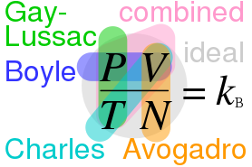

\newpage
\begin{center}
\Huge
Química

\Large
Formulario
\end{center}
\tableofcontents
\newpage

# Conversiones

### Peso

$\text{1 lb}=\text{453,6 g}$

$\text{1 kg}=\text{2,2 lb}$

$\text{1 oz}=\text{28,35 g}$

### Longitud

$\text{1 mi}=\text{1,61 km}$

$\text{1 m}=\text{3,28 ft}$

$\text{1 m}=39,4^{"}$

$1^{"}=\text{2,54 cm}$

### Gases

$\text{1 atm}=\text{760 mmHg}$

$\text{1 atm}=\text{101,33 kPa}$

$\text{1 atm}=\text{14,696 psi}$

$\text{1 torr}=\text{1 mmHg}$

$\text{1 torr}=\text{133,32 Pa}$

$\text{1 bar}=10^{5}\text{ Pa}$

### Termodinámica

$\text{1 cal}=\text{4,18 J}$

$\text{1 atmL}=\text{101,3 J}$

# Propiedades intensivas

$m=dv$

> (s), (l) = g/cm³; (g) = g/m³

$\text{º}C=(F-32)\frac{5}{9}$

$F=\frac{9}{5}\text{º}C+32$

$K=\text{º}C+273,15$

# Estequiometría

### Unidades de cantidad

$1uma=\frac{g}{mol}$

> El peso atómico se mide en uma's.

$1g=6,022{\cdot}10^{23}uma$

$N_{A}/L=6,022{\cdot}10^{23}\text{partículas}$

### Isótopo

$\bar{m}=m_{1}Ab_{1}+...+m_{n}Ab_{n}$

### Composición porcentual

$Mr={\Sigma}Ar$

$\%X=\frac{nAr}{Mr}100\%$

### Fórmulas químicas

$FM=nFE$

$m=nMr$

# Reacciones

### Rendimiento

$\%r=\frac{\text{real}}{\text{teórico}}100\%$

# Soluciones

$C_1V_1=C_2V_2$

$m_{\text{solución}}=m_{soluto}+m_{solvente}$

$V_{\text{solución}}=V_{soluto}+V_{solvente}$

### Molaridad $(M)$

$M=\frac{n_{soluto}}{V_{\text{solución}}}$

> $\text{volumen}=dm^3$

### Molalidad $(\eta)$

$\eta=\frac{n_{soluto}}{m_{solvente}}$

> $\text{masa}=kg$

### Fracción molar $(X)$

$X_{A}=\frac{n_{A}}{n_{\text{solución}}}$

$X_{B}=\frac{n_{B}}{n_{\text{solución}}}$

$X_{A}+X_{B}=1$

### Porcentaje en volumen $(V_\%)$

$V_\%=\frac{V_{soluto}}{V_{\text{solución}}}{\cdot}100\%$

> $\text{volumen}=cm^3$

### Porcentaje en masa $(m_\%)$

$m_\%=\frac{m_{soluto}}{m_{\text{solución}}}{\cdot}100\%$

> $\text{masa}=g$

### Partes por millón $(ppm)$

$m_\%=\frac{m_{soluto}}{m_{\text{solución}}}{\cdot}10^6$

> $\text{masa}=g$

# Gases

$R=8,314\frac{J}{K{\cdot}mol}$
$R=0,0821\frac{atm{\cdot}L}{K{\cdot}mol}$

### Ley de los gases ideales

$PV=nRT$

### Ecuación de estado

$\frac{P_{1}V_{1}}{n_{1}T_{1}}=\frac{P_{2}V_{2}}{n_{2}T_{2}}$

{ width=20% }

### Densidad de un gas

$\rho=\frac{MrP}{RT}$

### Ley de Dalton

$P_{A}=X_{A}P_{T}$

$P_{A}=\frac{n_{A}RT}{V}$

### Volumen molar de un gas

$1mol=22,7dm^{3}$

> Posible a a 273K y 1 atmósfera. Esto se conoce como condiciones normales de temperatura y presión (CNTP).

# Termodinámica

${\Delta}H=H_{productos}-H_{reactivos}$

$W={\pm}P{\Delta}V$

${\Delta}E={\pm}Q{\pm}W$

> ${\Delta}H=\text{+endotérmico, -exotérmico}$
>
> $W,Q=\text{+compresión, -expansión}$
