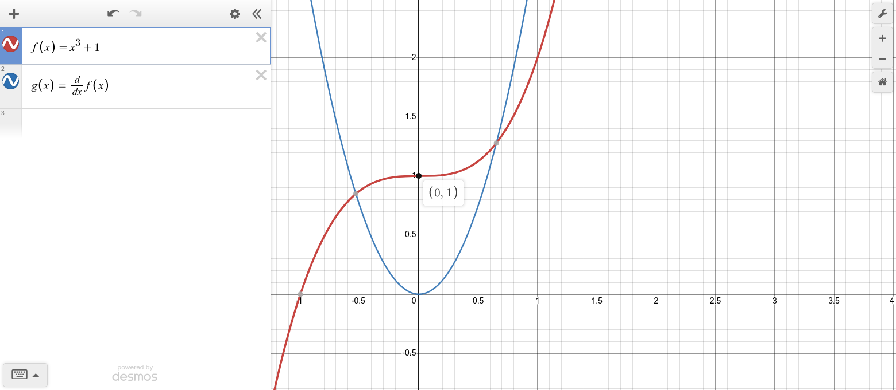

# Gráficas notables

### Exponencial natural y logarítmica natural

### Inversa

### $x^n;n\%2=0$

### $x^n;n\%2\ne0$

### Trigonométricas

**Seno**

**Coseno**

**Tangente**

**Secante y cosecante**

# Inversa

### Graficar

Si $g(x)$ es inversa de $f(x)$. Grafica la reflección de $f(x)$ en $x=y$.

# Simetría

### y de x (par)

$$
f(x)=f(-x)
$$

### y de x (impar)

$$
-f(x)=f(-x)
$$

# Transformaciones

### $y=f(x)+c$

$+c ↑$ $\S$ $-c ↓$

### $y=f(x+c)$

$+c ←$ $\S$ $-c →$

### $y=f(-x)$

$\updownarrow$

### $y=-f(x)$

### $y=cf(x)$

Extiende amplitud

### $y=f(cx)$

Reduce longitud de onda

### Valor absoluto

# Derivada de una función

# Pasos para graficar una función

### Principales

-   Cortes con los ejes

    $\begin{matrix*}[l] \text{eje }x & f(x)=0 \\ \text{eje }y & f(0) \end{matrix*}$

-   Dominio

    Identificar valores no definidos $(c_i)$ en el dominio

-   Asíntota vertical

    $c_i\ \text{es asíntota vertical}\Longleftrightarrow\lim\limits_{x→c_i}f(x)=\infty$

-   Asíntota horizontal

    $\lim\limits_{x→-\infty}f(x) = L$

    $\lim\limits_{x→+\infty}f(x) = L$

-   Intevalos de monotonía

    1.  Obtener primera derivada
    1.  Identificar valores no definidos
    1.  Analizar

### Secundarios

-   Interpretar simetría

    Revisar si es par primero

-   Puntos críticos

    Cortes con el eje $x$ ($p_i$) de $f^\prime(x)$, $f$ debe ser continua en $p_i$

    Evaluar $p_i$ con el método de preferencia: monotonía o segunda derivada

-   Intervalos de concavidad

    1.  Obtener segunda derivada
    1.  Identificar valores no definidos
    1.  Analizar

# Notas

-   Una función cóncava, también se llama cóncava hacia abajo, mientras que una función convexa es llamada cóncava hacia arriba.
