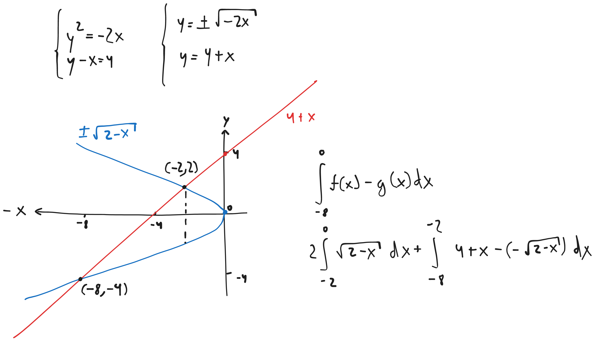
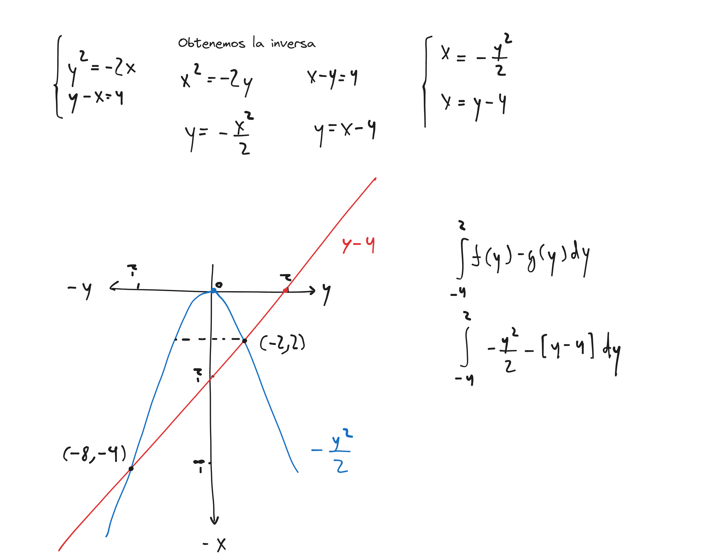
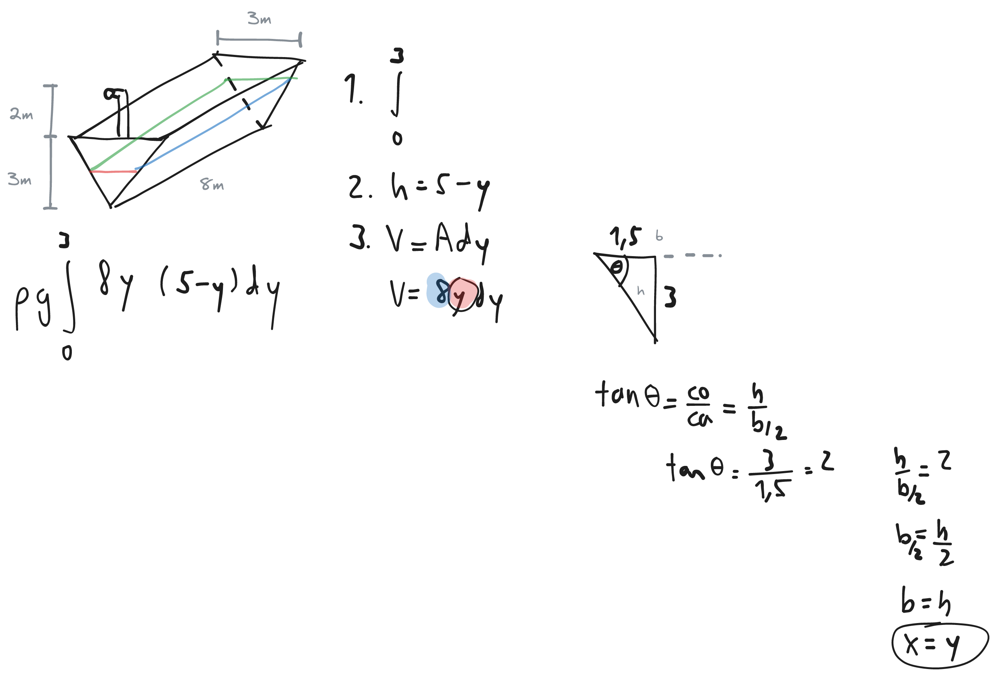

# Suma de Riemann

$f(x)=3x+2$

$[1,3]$

$$
\Delta x=\frac{b-a}{n}
$$

$$
\Delta x=\frac{3-1}{n}=\frac{2}{n}
$$

---

$$
x_i=a+\Delta x\cdot i
$$

$$
x_i=1+\frac{2}{n}i=1+\frac{2i}{n}
$$

---

$$
\lim\limits_{n→\infty}\sum^n_{i=1}f(x_i)\Delta x
$$

$$
\lim\limits_{n→\infty}\sum^n_{i=1}\left[3\left(1+\frac{2i}{n}\right)+2\right]\frac{2}{n}
$$

---

$$
\lim\limits_{n→\infty}\sum^n_{i=1}\left[3+\frac{6i}{n}+2\right]\frac{2}{n}
$$

$$
\lim\limits_{n→\infty}\sum^n_{i=1}\left[5+\frac{6i}{n}\right]\frac{2}{n}
$$

$$
\lim\limits_{n→\infty}\sum^n_{i=1}\left[\frac{10}{\cancel{n}}+\frac{12\cancel{i}}{\cancel{n^2}}\right]
$$

$$
\lim\limits_{n→\infty}\sum^n_{i=1}\left[10+\frac{12}{2}\right]=16
$$

### Aproximaciones

| Método                     | Ecuación                                  |
|----------------------------|-------------------------------------------|
| Esquina superior izquierda | $\sum^n_{i=1}f(x_{i})\Delta x$            |
| Esquina superior derecha   | $\sum^n_{i=1}f(x_{i}+\Delta x)\Delta x$   |
| Punto medio                | $\sum^n_{i=1}f(x_{i}+\Delta x/2)\Delta x$ |

# Integrales

$$
\int_{a}^{b}f(x)\ dx=\lim\limits_{n→\infty}\sum^n_{i=1}f(x_i)\Delta x
$$

**Definida**

$$
\int_{a}^{b}f(x)\ dx=F(b)-F(a)
$$

**Indefinida**

$$
\int f(x)\ dx=F(x)+c
$$

### Integrales notables

| Integral       | Función primitiva       |
|----------------|-------------------------|
| $\int x^n\ dx$ | $\frac{x^{n+1}}{n+1}+c$ |
| $\int a^x\ dx$ | $\frac{a^x}{\ln a}+c$   |
| $\int\frac{1}{x}\ dx$ | $\ln|x|+c$ |
| $\int\sec^2 x\ dx$ | $\tan x+c$ |
| $\int\csc^2 x\ dx$ | $-\cot x+c$|
| $\int\sec x\tan x\ dx$ | $\sec x+c$ |
| $\int\csc x\cot x\ dx$ | $-\csc x+c$ |
| $\int\sinh x\ dx$ | $\cosh x+c$ |
| $\int\cosh x\ dx$  | $\sinh x+c$|
| $\int\sec x\ dx$ | $\ln|\sec x+\tan x|+c$ |
| $\int\csc x\ dx$ | $\ln|\csc x-\cot x|+c$ |
| $\int\tan x\ dx$ | $\ln|\sec x|+c$ |
| $\int\cot x\ dx$ | $\ln|\sin x|+c$ |
| $\int\frac{1}{1+x^2}\ dx$ | $\arctan x+c$           |
| $\int\frac{1}{\sqrt{1-x^2}}\ dx$ | $\arcsin x+c$           |
| $\int\frac{1}{a^2+x^2}\ dx$ | $\frac{1}{a}\arctan\left(\frac{x}{a}\right)+c$ |
| $\int\frac{1}{\sqrt{a^2-x^2}}\ dx$ | $\arcsin\left(\frac{x}{a}\right)+c$ |
| $\int\frac{1}{x^2-a^2}\ dx$ | $\frac{1}{2a}\ln\left|\frac{x-a}{x+a}\right|+c$ |
| $\frac{1}{\sqrt{x^2\pm a^2}}\ dx$ | $\ln|x+\sqrt{x^2\pm a^2}|+c$ |

### Propiedades de las integrales

$$
\int_{a}^{b}cf(x)\ dx=c\int_{a}^{b}f(x)\ dx
$$

$$
\int_{a}^{b}f(x)\ dx=-\int_{b}^{a}f(x)\ dx
$$

$$
\int_{a}^{c}f(x)\ dx+\int_{c}^{b}f(x)\ dx=\int_{a}^{b}f(x)\ dx
$$

$$
m\le f(x)\le M\Longrightarrow m(b-a)\le\int_{a}^{b}f(x)\ dx\le M(b-a)
$$

### Cálculo de área

**Área total**

$$
\int_{a}^{b}|f(x)|\ dx
$$

**Área neta**

$$
\int_{a}^{b}f(x)\ dx
$$

### Teorema Fundamental del Cálculo. Parte 1

$F(x)=\int_{g(x)}^{h(x)}f(t)\ dt$

$$
F^{\prime}(x)=h^{\prime}(x)f(h(x))-g^{\prime}(x)f(g(x))
$$

### Método de sustitución

$x=g(t)$

$dx=g^{\prime}(t)\ dt$

$$
\int f(x)\ dx=\int f(g(t))\ g^{\prime}(t)\ dt
$$

Ejemplo

$\int\tan x\ dx$

$$
\int\frac{\sin x}{\cos x}\ dx
$$

$u=\cos x$

$du=-\sin x\ dx$

$$
\int\frac{(-du)}{u}
$$

$$
-\int\frac{1}{u}\ du
$$

$$
-\ln|u|+c
$$

$$
-\ln|\cos x|+c
$$

### Cálculo de área entre curvas

$$
\int f(x)-g(x)\ dx
$$

> $\begin{matrix} f(x) & \text{función exterior} \\ g(x) & \text{función interior} \end{matrix}$

**Por partes**

**Cambio de ejes**

### Volúmenes de revolución

| Desplazamiento del eje de rotación con respecto al origen | Signo después de $a$ |
| -------------- | --------------- |
| $>0$ | $-$ |
| $<0$ | $+$ |

**Método de discos**

$V=\pi\int_a^b f(x)^2\ dx$

> $V=\pi\int_a^b f(a\pm x)^2-g(a\pm x)^2\ dx$

-   Giro en $x$ $\rightarrow$ $dx$
-   Giro en $y$ $\rightarrow$ $dy$

**Método de cascarones cilíndricos**

$V=2\pi\int_a^b xf(x)\ dx$

> $V=2\pi\int_a^b (a\pm x)[f(x)-g(x)]\ dx$

-   Giro en $x$ $\rightarrow$ $dy$
-   Giro en $y$ $\rightarrow$ $dx$

### Trabajo

$$
W=\int_{a}^{b}F(x)\ dx
$$

**Trabajo hidráulico**

$$
W=\rho g\int_{a}^{b}Vh\ dy
$$

> $\rho=10^3\frac{kg}{m^3}=62.5\frac{lb}{ft^3}$
>
> $g=10\frac{m}{s^2}=32.1\frac{ft}{s^2}$

***Pasos***

1.  Identificar límites (rango en el que el agua está almacenada)
1.  Identificar altura (rango de extracción)
1.  Encontrar expresión de volumen
    -   Identificar área de sección transversal

Ejemplo

**Trabajo de un resorte**

$$
W=k\int x\ dx
$$

### Integración por partes

$$
udv=uv-\int vdu
$$

> Un día ví una vaca sin cola vestida de uniforme

**Para selección de $u$**

$$
\begin{matrix*}[l]
    I & \text{nversa} \\
    L & \text{ogarítmica} \\
    A & \text{lgebraica} \\
    T & \text{rigonométrica} \\
    E & \text{xponencial}
\end{matrix*}
$$

Ejemplo

$\int\ln x\ dx$

$\begin{matrix} u=\ln x & dv=1\ dx \\ du=\frac{1}{x}\ dx & v=x \end{matrix}$

$$
\int\ln x\ dx=\ln x\cdot x-\int x\frac{1}{x}\ dx
$$

$$
\int\ln x\ dx=\ln x\cdot x-\int 1\ dx
$$

$$
\int\ln x\ dx=\ln x\cdot x-x+c
$$

Ejemplo

$\int\frac{\ln x}{x}$

$$
\int\ln x\frac{1}{x}
$$

$\begin{matrix} u=\ln x & dv=\frac{1}{x}\ dx \\ du=\frac{1}{x}\ dx & v=\ln x \end{matrix}$

$$
\int\ln x\frac{1}{x}=\ln x\ln x-\int\ln x\frac{1}{x}\ dx
$$

$$
2\int\ln x\frac{1}{x}=\ln x\ln x
$$

$$
\int\frac{\ln x}{x}=\frac{(\ln x)^2}{2}+c
$$

### Valor promedio

$$
\frac{1}{b-a}\int_a^b f(x)\ dx
$$

### Sustituciones trigonométricas

**$\cos^n x$ - $n$ es impar**

$$
\int\sin^m x\cos^n x\ dx=\int\sin^m x(\cos^2 x)^{n-1}\cos x\ dx
$$

Ejemplo

$\int\cos^3 x\ dx$

$$
\int(\cos^2 x)\cos x\ dx
$$

$$
\int(1-\sin^2 x)\cos x\ dx
$$

$u=\sin x$

$du=\cos x\ dx$

$$
\int(1-u^2)\ du
$$

$$
u-\frac{u^3}{3}+c
$$

$$
\sin x-\frac{\sin^3 x}{3}+c
$$

**$\sin^n x$ - $n$ es impar**

$$
\int\sin^n x\cos^m x\ dx=\int\cos^m x(\sin^2 x)^{n-1}\sin x\ dx
$$

Ejemplo

$\int\sin^5 x\cos^2 x\ dx$

$$
\int\cos^2x(\sin^2 x)^2\sin x\ dx
$$

$$
\int\cos^2x(1-\cos^2 x)^2\sin x\ dx
$$

$u=\cos x$

$du=-\sin x\ dx$

$$
-\int u^2(1-u^2)^2\ du
$$

$$
-\int u^2-2u^4+u^6
$$

$$
-\frac{u^3}{3}+\frac{2u^5}{5}-\frac{u^7}{7}+c
$$

$$
-\frac{\cos^3 x}{3}+\frac{2\cos^5 x}{5}-\frac{\cos^7 x}{7}+c
$$

**$\sin^n x$ o $\cos^n x$ - $n$ es par**

$$
\sin^2 x=\frac{1-\cos(2x)}{2}
$$

$$
\cos^2 x=\frac{1+\cos(2x)}{2}
$$

Ejemplo

$\int\sin^4 x\ dx$

$$
\int(\sin^2 x)^2\ dx
$$

$$
\int\left[\frac{1-\cos(2x)}{2}\right]^2\ dx
$$

$$
\int\left[\frac{1}{2}-\frac{\cos(2x)}{2}\right]^2\ dx
$$

$$
\int\left[\frac{1}{4}-\frac{\cos(2x)}{2}+\frac{\cos^2(2x)}{4}\right]\ dx
$$

$$
\frac{1}{4}\int\left[1-2\cos(2x)+\cos^2(2x)\right]\ dx
$$

$\cos^2(2x)=\frac{1+\cos(2(2x))}{2}$

$$
\frac{1}{4}\int\left[1-2\cos(2x)+\left(\frac{1}{2}+\frac{\cos(4x)}{2}\right)\right]\ dx
$$

$$
\frac{1}{4}\int\left[\frac{3}{2}-2\cos(2x)+\frac{\cos(4x)}{2}\right]\ dx
$$

$$
\frac{1}{4}\left[\frac{3x}{2}-\sin(2x)+\frac{\sin(4x)}{8}\right]+c
$$

**$\sec^n x$ - $n$ es par**

$$
\int\tan^m x\sec^n x\ dx=\int\tan^m x(\sec^2 x)^{n-2}\sec^2 x\ dx
$$

Ejemplo

$\int\tan^6 x\sec^4 x\ dx$

$$
\int\tan^6 x(\sec^2 x)\sec^2 x\ dx
$$

$$
\int\tan^6 x(1+\tan^2 x)\sec^2 x\ dx
$$

$u=\tan x$

$du=\sec^2 x$

$$
\int u^6(1+u^2)\ du
$$

$$
\int u^6+u^8\ du
$$

$$
\frac{u^7}{7}+\frac{u^8}{8}+c
$$

$$
\frac{\tan^7 x}{7}+\frac{\tan^8 x}{8}+c
$$

**$\tan^n x$ - $n$ es impar**

$$
\int\tan^n x\sec^m x\ dx=\int(\tan^2 x)^{n-1}\sec^{n-1}x\sec x\tan x\ dx
$$

Ejemplo

$\int\tan^5 x\sec^7 x\ dx$

$$
\int\sec^6 x(tan^2 x)^2\sec x\tan x\ dx
$$

$$
\int\sec^6 x(\sec^2 x-1)^2\sec x\tan x\ dx
$$

$u=\sec x\ dx$

$du=\sec x\tan x\ dx$

$$
\int u^6(u^2-1)^2\ du
$$

$$
\int u^{10}-2u^8+u^6\ du
$$

$$
\frac{u^{11}}{11}-\frac{2u^9}{9}+\frac{u^7}{7}+c
$$

$$
\frac{\sec^{11} x}{11}-\frac{2\sec^9 x}{9}+\frac{\sec^7 x}{7}+c
$$

**Producto de potencias seno y coseno**

$$
\sin A\cdot\cos B=\frac{1}{2}\left[\sin(A-B)+\sin(A+B)\right]
$$

$$
\sin A\cdot\sin B=\frac{1}{2}\left[\cos(A-B)-\cos(A+B)\right]
$$

$$
\cos A\cdot\cos B=\frac{1}{2}\left[\cos(A-B)+\cos(A+B)\right]
$$

**Raíces**

$$
\sqrt{a^2-x^2},x=a\sin\theta
$$

$$
\sqrt{a^2+x^2},x=a\tan\theta
$$

$$
\sqrt{x^2-a^2},x=a\sec\theta
$$

### Integración racional: fracciones parciales

$$
f(x)=\frac{P(x)}{Q(x)}
$$

$P(x)$ es menor en grado que $Q(x)$

**Pasos**

1.  Descomponer en factores $Q(x)$ tan cuánto se pueda
1.  Fórmula
    1.  Expresión simple
    1.  Expresión m.c.m
1.  Encontrar coeficientes.
    1.  Emplear métodos
        1.  Simple
            -   Raíces reales y diferentes
            -   Raíz repetida del grado más alto
        1.  Comparación numerador original con numerador m.c.m
    1.  Resolver sistema de ecuaciones
1.  Reemplazar coeficientes en expresión simple e integrar

**Caso 1: Raíces reales y diferentes**

$$
\frac{P(x)}{Q(x)}=\frac{A_1}{a_1x+b_1}+\frac{A_2}{a_2x+b_2}+\cdots+\frac{A_n}{a_nx+b_n}
$$

Ejemplo

$$
\frac{1}{x(2x-1)(x+2)}=\frac{A}{x}+\frac{B}{2x-1}+\frac{C}{x+2}
$$

**Caso 2: Raíces reales y repetidas**

$$
\frac{P(x)}{Q(x)}=\frac{A_1}{(ax+b)^1}+\frac{A_2}{(ax+b)^2}+\cdots+\frac{A_n}{(ax+b)^n}
$$

Ejemplo

$$
\frac{1}{x^2(x-1)^3}=\frac{A}{x}+\frac{B}{x^2}+\frac{C}{x-1}+\frac{D}{(x-1)^2}+\frac{E}{(x-1)^3}
$$

**Caso 3: Raíces complejas y diferentes**

$$
\frac{P(x)}{Q(x)}=\frac{A_x+B}{ax^2+bx+c}
$$

Ejemplo

$$
\frac{1}{(x-2)(x^2+1)(x^2+4)}=\frac{A}{x-2}+\frac{Bx+C}{x^2+1}+\frac{Dx+E}{x^2+4}
$$

**Caso 4: Raíces complejas y repetidas**

$$
\frac{P(x)}{Q(x)}=\frac{A_1x+B_1}{(ax^2+bx+c)^1}+\frac{A_2x+B_2}{(ax^2+bx+c)^2}+\cdots+\frac{A_nx+B_n}{(ax^2+bx+c)^n}
$$

Ejemplo

$$
\frac{1}{x(x-1)(x^2+x+1)(x^2+1)^3}=\frac{A}{x}+\frac{B}{x-1}+\frac{Cx+D}{x^2+x+1}+\frac{Ex+F}{x^2+1}+\frac{Gx+H}{(x^2+1)^2}+\frac{Ix+J}{(x^2+1)^3}
$$

### Longitud de curva

$$
\int\sqrt{1+[f^{\prime}(x)]^2}\ dx
$$

### Área superficial

| \phantom{-} | $y=f(x)$ | $x=f(x)$ |
| --------------- | --------------- | --------------- |
| eje $x$ | $\int 2\pi f(x)\sqrt{1+[f^{\prime}(x)]^2}\ dx$ | $\int 2\pi y\sqrt{1+[f^{\prime}(y)]^2}\ dy$ |
| eje $y$ | $\int 2\pi x\sqrt{1+[f^{\prime}(x)]^2}\ dx$ | $\int 2\pi f(y)\sqrt{1+[f^{\prime}(y)]^2}\ dy$ |

# Convergencia, divergencia

Cuando el límite tiende hacia el infinito, la integral, sucesión o serie es divergente; de lo contrario, es convergente.

### Integral impropia

Sirve para calcular área de $f(x),a\le x\le b$ cuando $a$ o $b$ no están definidos

**Definición tipo 1**

$$
\int_a^{\infty}f(x)\ dx=\lim\limits_{t→\infty}\int_a^t f(x)\ dx
$$

**Definición tipo 2**

$f(x)=[a,b)$

$$
\lim\limits_{t→b^-}=\int_a^t f(x)\ dx
$$

**Teorema de comparación**

Condiciones

$$
f(x)\ge g(x)\ge0\land f\text{ y }g\text{ son continuas en }x\ge a
$$

Casos

\begin{center}
Si $\int_a^{\infty}f(x)\ dx$ es convergente, entonces $\int_a^{\infty}g(x)\ dx$ es convergente

Si $\int_a^{\infty}g(x)\ dx$ es divergente, entonces $\int_a^{\infty}f(x)\ dx$ es divergente
\end{center}

### Sucesiones

**Teoremas**

$$
\lim\limits_{n→\infty}a_n=L\Longleftrightarrow\lim\limits_{x→\infty}f(x)=L\land f(n)=a_n
$$

$$
\lim\limits_{n→\infty}a_n=0\Longleftrightarrow\lim\limits_{n→\infty}|a_n|=0
$$

$$
\lim\limits_{n→\infty}f(a_n)=f(L)\Longleftrightarrow \lim\limits_{n→\infty}a_n=L\land f\text{ es continua en }L
$$

**Sucesión ${r^n}$**

$$
\lim\limits_{n→\infty}r^n=\left\{\begin{matrix} r=1 & 1 \\ -1 < r < 1 & 0 \end{matrix}\right.
$$

### Series

$$
S_n=\sum_{n=1}^{\infty}a_n
$$

**Tipo P**

$$
\sum_{n=1}^{\infty}\frac{1}{x^p}
$$

$$
\begin{matrix}
    p>1 & \text{convergente} \\
    p\le1 & \text{divergente}
\end{matrix}
$$

**Aritmética**

$$
\sum_{n=1}^{\infty}a_n r^{n-1}
$$
