# Suma de Riemann

$f(x)=3x+2$

$[1,3]$

1.  $\Delta x=\frac{b-a}{n}$

    $\Delta x=\frac{3-1}{n}=\frac{2}{n}$

2.  $x_i=a+\Delta x\cdot i$

    $x_i=1+\frac{2}{n}i=1+\frac{2i}{n}$

3.  $\lim\limits_{n→\infty}\sum^n_{i=1}f(x_i)\Delta x$

    $\lim\limits_{n→\infty}\sum^n_{i=1}\left[3\left(1+\frac{2i}{n}\right)+2\right]\frac{2}{n}$

4.  $\lim\limits_{n→\infty}\sum^n_{i=1}\left[3+\frac{6i}{n}+2\right]\frac{2}{n}$

    $\lim\limits_{n→\infty}\sum^n_{i=1}\left[5+\frac{6i}{n}\right]\frac{2}{n}$

    $\lim\limits_{n→\infty}\sum^n_{i=1}\left[\frac{10}{\cancel{n}}+\frac{12\cancel{i}}{\cancel{n^2}}\right]$

    $\lim\limits_{n→\infty}\sum^n_{i=1}\left[10+\frac{12}{2}\right]=16$

### Aproximaciones

**Esquina superior izquierda**

$\sum^n_{i=1}f(x_{i})\Delta x$

**Esquina superior derecha**

$\sum^n_{i=1}f(x_{i}+\Delta x)\Delta x$

**Punto medio**

$\sum^n_{i=1}f\left(x_{i}+\frac{\Delta x}{2}\right)\Delta x$

# Integrales

$\int_{a}^{b}f(x)\ dx=\lim\limits_{n→\infty}\sum^n_{i=1}f(x_i)\Delta x$

**Definida**

$\int_{a}^{b}f(x)\ dx=F(b)-F(a)$

**Indefinida**

$\int f(x)\ dx=F(x)+c$

### Integrales notables

| Integral               | Función primitiva       |
|------------------------|-------------------------|
| $\int x^n\ dx$         | $\frac{x^{n+1}}{n+1}+c$ |
| $\int \csc x\cot x$    | $-\csc x+c$             |
| $\int \frac{1}{1+x^2}$ | $\arctan x+c$           |

### Propiedades de las integrales

-   $\int_{a}^{b}c\ dx=c(b-a)$
-   $\int_{a}^{b}cf(x)\ dx=c\int_{a}^{b}f(x)\ dx$
-   $\int_{a}^{b}f(x)\ dx=-\int_{b}^{a}f(x)\ dx$
-   $\int_{a}^{c}f(x)\ dx+\int_{c}^{b}f(x)\ dx=\int_{a}^{b}f(x)\ dx$
-   $m\le f(x)\le M\Longrightarrow m(b-a)\le\int_{a}^{b}f(x)\ dx\le M(b-a)$

    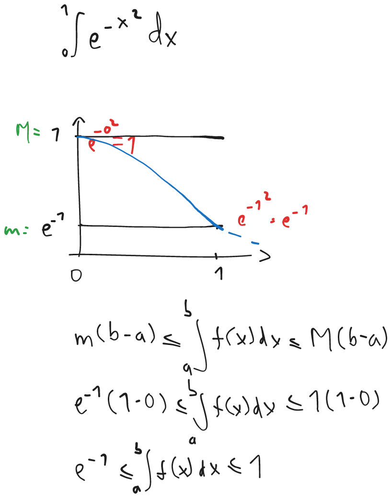{ width=40% }

### Cálculo de área

$\text{Área total: }\int_{a}^{b}|f(x)|\ dx$

$\text{Área neta: }\int_{a}^{b}f(x)\ dx$

### Teorema fundamental del cálculo

$F(x)=\int_{g(x)}^{h(x)}f(t)\ dt$

$\colorbox{yellow}{\vphantom{|}}\ F^{\prime}(x)=h^{\prime}(x)f(h(x))-g^{\prime}(x)f(g(x))$

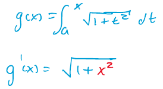{ width=20% }

1.  $\phantom{-}$

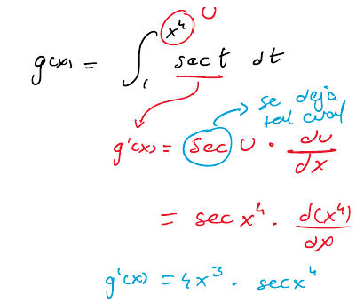{ width=30% }

2.  $\phantom{-}$

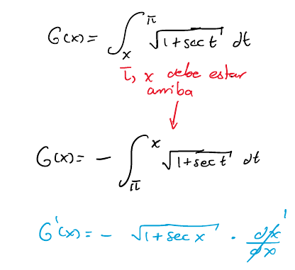{ width=30% }

3.  $\phantom{-}$

    1. $\phantom{-}$

    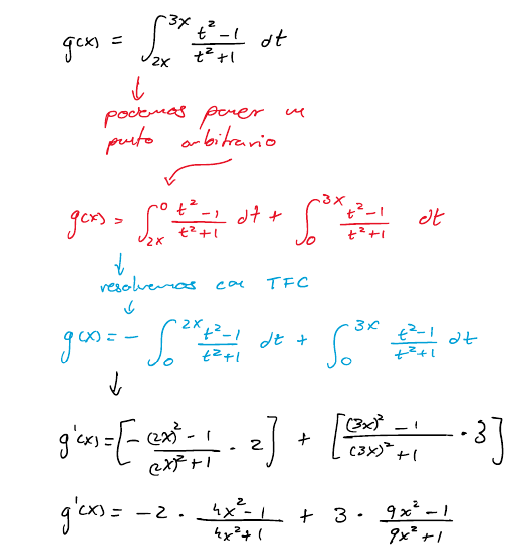{ width=40% }

    2. $\phantom{-}$

    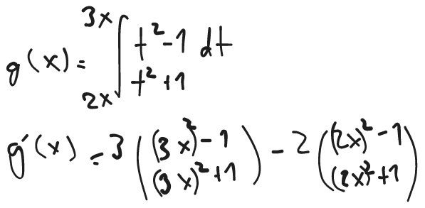{ width=25% }

### Método de sustitución

$x=g(t)$

$dx=g^{\prime}(t)\ dt$

$\colorbox{yellow}{\vphantom{|}}\ \int f(x)\ dx=\int f(g(t))\ g^{\prime}(t)\ dt$

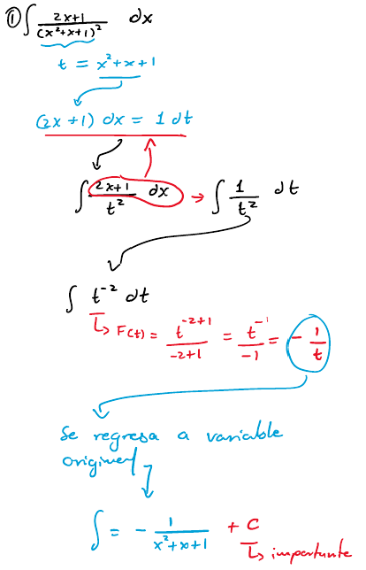{ width=40% }

### Cálculo de área entre curvas

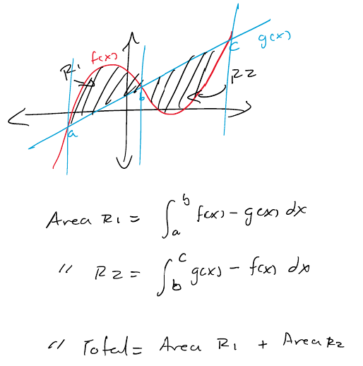{ width=40% }

\rule{\linewidth}{0.4pt}

1.  Por partes

    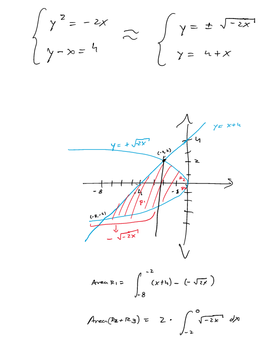{ width=40% }

1.  Cambio de ejes

    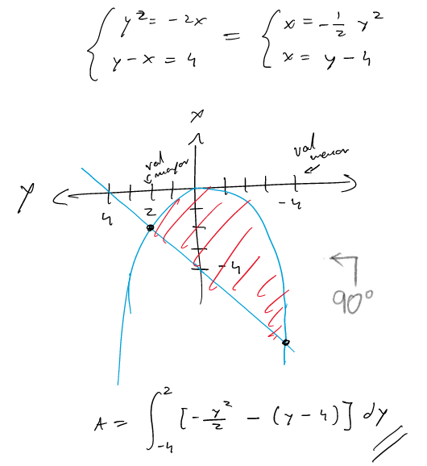{ width=40% }

### Volumenes de revolución

**Método de discos**

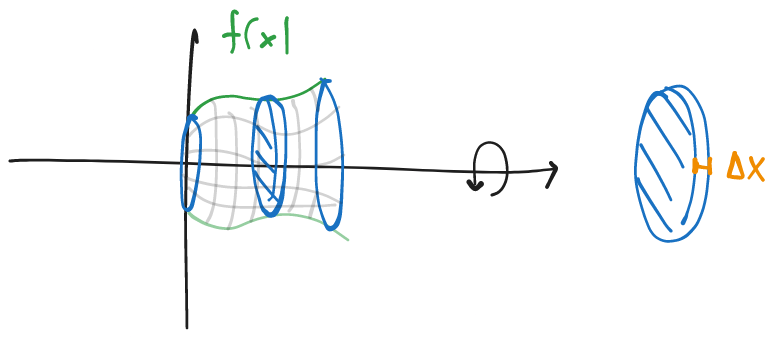{ width=45% }

$V=Abh$

$V=\pi r^2h\Delta x$

$V=\lim\limits_{\Delta x\to0}\sum_{i=1}^{n}\pi[f(x_i)]^2\Delta x$

$\colorbox{yellow}{\vphantom{|}}\ V=\pi\int_a^b f(x)^2\ dx$

**Método de arandelas**

$V=\pi\int_a^b f(x)^2-g(x)^2\ dx$

\rule{\linewidth}{0.4pt}

Tanto en el método de discos y arandelas:

-   Si giro alrededor del eje $x$; entonces $dx$ y límites en $x$
-   Si giro alrededor del eje $y$; entonces $dy$ y límites en $y$

\rule{\linewidth}{0.4pt}

**Método de capas cilíndricas**

$V=2\pi\int_a^b xf(x)\ dx$

**Método de los cascarones cilíndricos**

$V=2\pi\int_a^b x[f(x)-g(x)]\ dx$

\rule{\linewidth}{0.4pt}

Tanto en el método de capas y cascarones cilíndricos:

-   Si giro alrededor del eje $x$; entonces $dy$ y límites en $y$
-   Si giro alrededor del eje $y$; entonces $dx$ y límites en $x$

\rule{\linewidth}{0.4pt}

### Trabajo mecánico

$W=\int_{a}^{b}F(x)\ dx$
