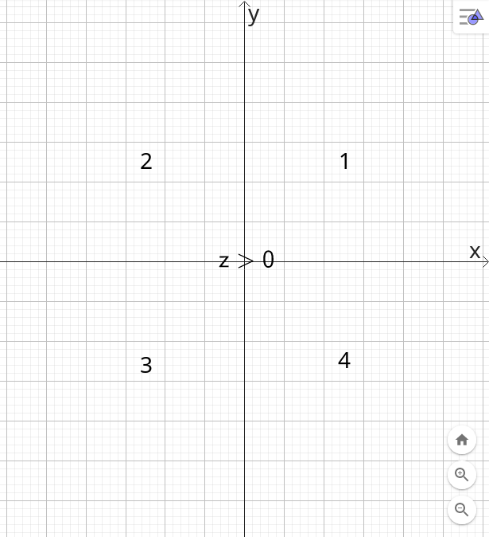
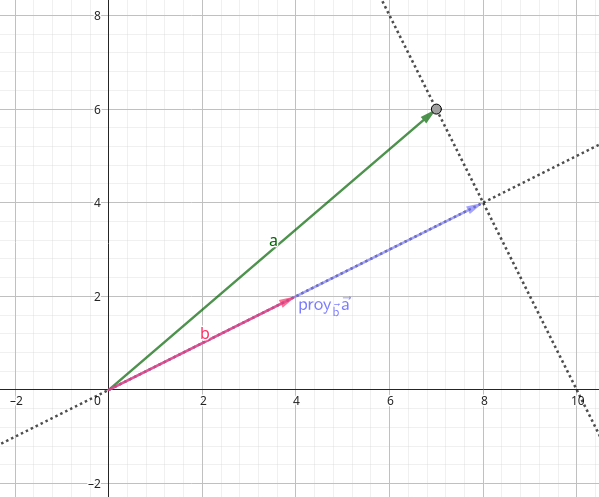
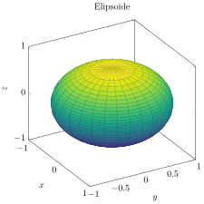
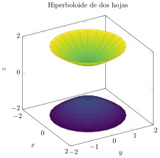

# 12.1 Sistema de coordenadas tridimensional

### Octantes

::: {.columns column-count=2}

:::

### Superficies

::: {.columns column-count=2}

:::

# 12.2 Vectores

### Operaciones

$$
\vec{a}+\vec{b}=\langle a_1+b_1,a_2+b_2,\cdots,a_n+b_n \rangle
$$

$$
\vec{a}-\vec{b}=\langle a_1-b_1,a_2-b_2,\cdots,a_n-b_n \rangle
$$

$$
c\vec{a}=\langle ca_1,ca_2,\cdots,ca_n \rangle
$$

### Vectores base

$$
\hat{i}=\langle 1,0,0 \rangle
$$

$$
\hat{j}=\langle 0,1,0 \rangle
$$

$$
\hat{k}=\langle 0,0,1 \rangle
$$

### Longitud o magnitud

$$
|\vec{a}|=\sqrt{a_1^2+a_2^2+\cdots+a_n^2}
$$

### Vector unitario

$$
\hat{v}=\vec{u}=\frac{1}{|\vec{v}|}\vec{v}
$$

# 12.3 Producto punto

$$
\vec{a}\cdot\vec{b}=a_1b_1+a_2b_2+\cdots+a_nb_n
$$

$$
\vec{a}\cdot\vec{b}=|a||b|cos\theta
$$

### Propiedades y teoremas

$$
\vec{a}\cdot\vec{a}=|a|^2
$$

Es conmutativo y es asociativo

Si $\theta>\frac{\pi}{2}$ el resultado del producto punto es negativo

$\vec{a}$ es ortogonal (perpendicular) con respecto a $\vec{b}$ cuando $\vec{a}\cdot\vec{b}=0$

### Proyección escalar

$$
\text{comp}_{\vec{a}}\vec{b}=|\vec{b}|\cos\theta
$$

$$
\text{comp}_{\vec{a}}\vec{b}=\frac{\vec{a}\cdot\vec{b}}{|\vec{a}|}
$$

> Proyección escalar de $\vec{b}$ en $\vec{a}$

Ejemplo

$\vec{a}=\langle7,6\rangle$

$\vec{b}=\langle-4,-2\rangle$

$$
\text{comp}_{\vec{b}}\vec{a}=\frac{\vec{b}\cdot\vec{a}}{|\vec{b}|}
$$

$$
\text{comp}_{\vec{b}}\vec{a}=\frac{7(-4)+6(-2)}{\sqrt{(-4)^2+(-2)^2}}
$$

$$
\text{comp}_{\vec{b}}\vec{a}=-8.94
$$

### Proyección vectorial

$$
\text{proy}_{\vec{a}}\vec{b}=\frac{\vec{a}\cdot\vec{b}}{|\vec{a}|^2}\vec{a}
$$

> Proyección vectorial de $\vec{b}$ en $\vec{a}$

Ejemplo

$\vec{a}=\langle7,6\rangle$

$\vec{b}=\langle4,2\rangle$

$$
\text{proy}_{\vec{a}}\vec{b}=\frac{\vec{b}\cdot\vec{a}}{|\vec{b}|^2}\vec{b}
$$

$$
\text{proy}_{\vec{a}}\vec{b}=\frac{7(4)+6(2)}{4^2+2^2}\langle4,2\rangle
$$

$$
\text{proy}_{\vec{a}}\vec{b}=\frac{40}{20}\langle4,2\rangle
$$

$$
\text{proy}_{\vec{a}}\vec{b}=\langle8,4\rangle
$$

### Ángulos directores

$$
\hat{a}=\langle\cos\alpha,\cos\beta,\cos\gamma\rangle
$$

# 12.4 Producto cruz

-   Vector simultáneamente perpendicular a otros dos vectores
-   La magnitud del producto cruz representa geométricamente un área

$$
\vec{a}\times\vec{b}=\left|
    \begin{matrix} \hat{i} & \hat{j} & \hat{k} \\ a_1 & a_2 & a_3 \\ b_1 & b_2 & b_3 \end{matrix}
\right|
$$

### Propiedades y teoremas

$$
\vec{a}\times\vec{b}=-(\vec{b}\times\vec{a})
$$

No es conmutativo ni asociativo

$$
|\vec{a}\times\vec{b}|=|a||b|\sin\theta
$$

$\vec{a}$ es paralelo con respecto a $\vec{b}$ cuando $\vec{a}\times\vec{b}=0$

### Volumen

$$
V=|\vec{a}\cdot(\vec{b}\times\vec{c})|
$$

### Triple producto

$$
\vec{a}\times(\vec{b}\times\vec{c})
$$

# 12.5 Ecuaciones de líneas y planos

### Ecuaciones de línea

$$
\vec{r}=\vec{r}_0+t\vec{v}
$$

$$
\langle x,y,z\rangle=\langle x_0,y_0,z_0\rangle+t\langle a,b,c\rangle
$$

> Recta paralela a $\vec{v}$ que pasa por el punto $(x_0,y_0,z_0)$

**Ecuaciones paramétricas**

En términos de una variable

$$
x=x_0+at{\qquad}y=y_0+bt{\qquad}z=z_0+ct
$$

**Ecuaciones simétricas**

En términos de $t$

$$
\frac{x-x_0}{a}=\frac{y-y_0}{b}=\frac{z-z_0}{c}
$$

### Segmentos

$$
\vec{r}=(1-t)\vec{r}_0+t\vec{r}_1;0\le t\le1
$$

> Segmento que pasa por el punto $(x_0,y_0,z_0)$ hasta $(x_1,y_1,z_1)$

### Planos

**Ecuación vectorial**

$$
\vec{n}\cdot(\vec{r}-\vec{r}_0)=0
$$

$$
\langle a,b,c\rangle\cdot(\langle x,y,z\rangle-\langle x_0,y_0,z_0\rangle)=0
$$

> $\vec{n}$ se lo conoce como "vector normal", este es perpendicular al plano.

**Ecuación escalar**

$\vec{n}=\langle a,b,c\rangle$

$P_0(x_0,y_0,z_0)$

$$
a(x-x_0)+b(y-y_0)+c(z-z_0)=0
$$

**Ecuación lineal**

$$
ax+by+cz+d=0;d=-(ax_0+by_0+cz_0)
$$

### Distancias

$$
D=|\text{comp}_{\vec{n}}\vec{b}|=\frac{|\vec{n}\cdot\vec{b}|}{|\vec{n}|}
$$

$$
D=\frac{|ax_0+by_0+cz_0+d|}{\sqrt{a^2+b^2+c^2}}
$$

# 12.6 Cilindros y superficies cuadráticas

| Superficie cuadrática                            | Ecuación                                             |
|--------------------------------------------------|------------------------------------------------------|
|  | $\displaystyle{\frac{x^2}{a^2}+\frac{y^2}{b^2}+\frac{z^2}{c^2}=1}$  |
|  | $\displaystyle{\frac{x^2}{a^2}+\frac{y^2}{b^2}-\frac{z^2}{c^2}=1}$  |
|  | $\displaystyle{-\frac{x^2}{a^2}-\frac{y^2}{b^2}+\frac{z^2}{c^2}=1}$ |
|  | $\displaystyle{\frac{x^2}{a^2}+\frac{y^2}{b^2}-\frac{z^2}{c^2}=0}$  |
|  | $\displaystyle{\frac{x^2}{a^2}+\frac{y^2}{b^2}-\frac{z}{c}=0}$      |
|  | $\displaystyle{\frac{x^2}{a^2}-\frac{y^2}{b^2}-\frac{z}{c}=0}$      |

# 13.1 Funciones vectoriales y curvas en el espacio

### Función vectorial

$$
\vec{r}(t)=\langle f(t),g(t),h(t)\rangle
$$

### Límites

$$
\lim\limits_{t→a}\vec{r}(t)=\left\langle\lim\limits_{t→a}f(t),\lim\limits_{t→a}g(t),\lim\limits_{t→a}h(t)\right\rangle
$$

### Continuidad

$\vec{r}$ es continua en $t=a$ si

$$
\lim\limits_{t→a}\vec{r}(t)=\vec{r}(a)
$$

### Curvas en el espacio

$$
C={(x,y,z):x=f(t),y=g(t),z=h(t),a\le t\le b}
$$

$f$, $g$ y $h$ son continuas

# 13.2 Derivadas e integrales de funciones vectoriales

### Derivadas

$$
\vec{r}^{\prime}(t)=\langle f^{\prime}(t),g^{\prime}(t),h^{\prime}(t)\rangle
$$

**Reglas de diferenciación**

$$
\frac{d}{dt}[\vec{u}(t)\cdot\vec{v}(t)]=\vec{u}^{\prime}(t)\cdot\vec{v}(t)+\vec{u}(t)\cdot\vec{v}^{\prime}(t)
$$

$$
\frac{d}{dt}[\vec{u}(t)\times\vec{v}(t)]=\vec{u}^{\prime}(t)\times\vec{v}(t)+\vec{u}(t)\times\vec{v}^{\prime}(t)
$$

### Integrales

$$
\int_a^b\vec{r}(t)=\left\langle\int_a^bf(t),\int_a^bg(t),\int_a^bh(t)\right\rangle
$$

### Misceláneo

**Vector tangente unitario**

$$
\vec{T}(t)=\frac{\vec{r}^{\prime}(t)}{|\vec{r}^{\prime}(t)|}
$$

# 13.3 Longitud de arco y curvatura

### Longitud de arco

$$
L=\int_a^b|r^{\prime}(t)|dt
$$

### Función longitud de arco

$$
s(t)=\int_a^t|r^{\prime}(u)|du
$$

### Curvatura

$$
\kappa(t)=\frac{|\vec{T}^{\prime}(t)|}{|\vec{r}^{\prime}(t)|}
$$

$$
\kappa(t)=\frac{|\vec{r}^{\prime}(t)\times\vec{r}^{\prime\prime}(t)|}{|\vec{r}^{\prime}(t)|^3}
$$

$$
\kappa(x)=\frac{|f^{\prime\prime}(x)|}{[1+(f^{\prime}(x))^2]^{\frac{3}{2}}}
$$

### Vector normal y binormal

**Vector normal**

$$
\vec{N}(t)=\frac{\vec{T}^{\prime}(t)}{|\vec{T}^{\prime}(t)|}
$$

**Vector binormal**

$$
\vec{B}(t)=\vec{T}(t)\times\vec{N}(t)
$$

### Plano normal, osculante

**Plano normal**

Compuesto por el vector normal y binormal

**Plano osculante**

Compuesto por el vector normal y tangente

### Círculo osculante

Ubicado en el plano osculante, su radio está dado por:

> También llamado "círculo de curvatura"

$$
\rho(t)=\frac{1}{\kappa(t)}
$$

# 13.4 Movimiento en el espacio: velocidad y aceleración

$|\vec{v_0}|=\mathcal{v}_0$

$$
\vec{F}(t)=m\vec{a}(t)
$$

$$
\vec{v_0}=\mathcal{v}_0\cos\alpha\,\hat{i}+\mathcal{v}_0\sin\alpha\,\hat{j}
$$

$$
\vec{v}(t)=\vec{v_0}-gt\,\hat{j}
$$

$$
\vec{r}(t)=\vec{v_0}t-\frac{1}{2}gt^2\,\hat{j}
$$

$$
x=(\mathcal{v}_0\cos\alpha)t
$$

$$
y=(\mathcal{v}_0\sin\alpha)t-\frac{1}{2}gt^2
$$

$$
d=\frac{\mathcal{v}_0^2\sin(2\alpha)}{g}
$$

$$
t_d=\frac{2\mathcal{v}_0\sin\alpha}{g}
$$

# 14.1 Funciones de varias variables

### Dominio y rango

**Dominio**

$$
D=\{(x,y):(x,y)\in\mathbb{R}^2\}
$$

**Rango**

$$
R=\{f(x,y):(x,y)\in D\}
$$

### Curvas y superficies de nivel

**Curvas de nivel**

$$
f(x,y)=k
$$

**Superficies de nivel**

$$
f(x,y,z)=k
$$

# 14.2 Límites y continuidad

### Límites

Para demostrar que el límite de una función multivariable no existe se debe encontrar valores distintos del límite al calcularlo por distintas trayectorias.

Para demostrar que el límite de una función multivariable existe se debe hacer la prueba delta, epsilon: Si para cada número $\epsilon>0$ existe un número correspondiente $\delta>0$ tal que si $\vec{v}\in D$ y $0<|\vec{v}-\vec{v_0}|<\delta$ entonces $|f(\vec{v})-L|<\epsilon$

### Continuidad

$f(x,y)$ es continua en $(a,b)$ si

$$
\lim\limits_{(x,y)→(a,b)}f(x,y)=f(a,b)
$$

# 14.3 Derivadas parciales

$$
f_x=\frac{\partial f}{\partial x}
$$

$$
f_{xx}=\frac{\partial^2f}{\partial x^2}
$$

$$
f_{xy}=\frac{\partial^2f}{\partial y\partial x}
$$

### Teorema de Clairaut

Siendo $f$ definida en un vecindario $D$ que contiene el punto $(a,b)$. Si las funciones $f_{xy}$ y $f_{yx}$ son continuas en $D$, entonces:

$$
f_{xy}(a,b)=f_{yx}(a,b)
$$

# 14.4 Planos tangentes y aproximaciones lineales

### Plano tangente

**Expresión tiene forma ecuación general**

$$
\nabla f(x,y,z)=\langle f_x,f_y,f_z\rangle
$$

$$
a(x-x_0)+b(y-y_0)+c(z-z_0)=0
$$

Ejemplo

Encuentre el plano tangente de $x^2+y^2-z=0$ en $(0,1)$

$$
\nabla f(x,y)=\langle2x,2y,-1\rangle
$$

$$
\nabla f(0,1)=\langle0,2,-1\rangle
$$

$$
a(x-x_0)+b(y-y_0)+c(z-z_0)=0
$$

$$
0(x-0)+2(y-1)+(-1)(z-f(0,1))=0
$$

$$
z=2y-1
$$

**Expresión tiene forma función**

$$
z-z_0=f_x(x_0,y_0)(x-x_0)+f_y(x_0,y_0)(y-y_0)
$$

Ejemplo

Encuentre el plano tangente de $f(x,y)=x^2+y^2$ en $(0,1)$

$f_x(x,y)=2x$

$f_y(x,y)=2y$

$$
z-z_0=f_x(x_0,y_0)(x-x_0)+f_y(x_0,y_0)(y-y_0)
$$

$$
z-f(0,1)=f_x(0,1)(x-0)+f_y(0,1)(y-1)
$$

$$
z-1=0(x-0)+2(y-1)
$$

$$
z=2y-1
$$

### Aproximación lineal

Si existe $f_x$ y $f_y$ en $(a,b,c)$ y son continuas en $(a,b,c)$ entonces $f$ es derivable.

Si $f$ es derivable en $(a,b,c)$ entonces $f(a,b,c)\approx L(a,b,c)$

$$
L\approx z_0+f_x(x_0,y_0)(x-x_0)+f_y(x_0,y_0)(y-y_0)
$$

# 14.5 Regla de la cadena

### Caso 1

$z=f(x,y),x=g(t),y=h(t)$

$$
\frac{dz}{dt}=\frac{\partial z}{\partial x}\frac{dx}{dt}+\frac{\partial z}{\partial y}\frac{dy}{dt}
$$

> Diferencial de $z$

### Caso 2

$z=f(x,y),x=g(s,t),y=h(s,t)$

$$
\frac{\partial f}{\partial s}=\frac{\partial f}{\partial x}\frac{dx}{ds}+\frac{\partial f}{\partial y}\frac{dy}{ds}
$$

$$
\frac{\partial f}{\partial t}=\frac{\partial f}{\partial x}\frac{dx}{dt}+\frac{\partial f}{\partial y}\frac{dy}{dt}
$$

### Diferenciación implícita

**Expresión tiene forma ecuación**

Derivar ambos lados de la ecuación.

Ejemplo

Encuentre $y^\prime$ para $x^3+y^3=6xy$

$$
3x^2+3y^2y^\prime=6xy^\prime+6y
$$

$$
3y^2y^\prime-6xy^\prime=6y-3x^2
$$

$$
y^\prime(3y^2-6x)=6y-3x^2
$$

$$
y^\prime=\frac{6y-3x^2}{3y^2-6x}
$$

**Expresión tiene forma función**

$z=f(x,y)$

$$
\frac{dy}{dx}=-\frac{f_x}{f_y}
$$

Ejemplo

Encuentre $y^\prime$ para $f(x,y)=x^3+y^3-6xy$

$$
f_x(x,y)=3x^2-6y
$$

$$
f_y(x,y)=3x^2-6x
$$

$$
\frac{dy}{dx}=-\frac{3x^2-6y}{3y^2-6x}
$$

$w=f(x,y,z)$

$$
\frac{\partial z}{\partial x}=-\frac{f_x}{f_z}{\qquad}\frac{\partial z}{\partial y}=-\frac{f_y}{f_z}
$$

# 14.6 Derivadas direccionales y su vector gradiente

$$
\hat{v}=\langle a,b\rangle=\langle\cos\theta,\sin\theta\rangle
$$

### Gradiente

$$
\nabla f(x,y)=\langle f_x(x,y),f_y(x,y)\rangle
$$

### Derivada direccional

$$
Duf(x,y)=\nabla f(x,y)\cdot\hat{v}
$$

### Tasa máxima de cambio

Ocurre cuando $\hat{v}$ tiene la misma dirección que $\nabla f$, es decir $\theta=0$

Por tanto, esta es igual a $|\nabla f|$

> También se le refiere como "valor máximo de la derivada direccional"

# 14.7 Valores máximos y mínimos

Un punto crítico de $f$ es un punto $(a,b)$ en el dominio de $f$ tal que $\nabla f(a,b)=\vec{0}$ o $\nabla f(a,b)$ no existe.

Un extremo local es punto crítico $(a,b)$ donde $\nabla f(a,b)=\vec{0}$

### Método para hallar extremos locales

$$
D(a,b)=f_{xx}(a,b)f_{yy}(a,b)-[f_{xy}(a,b)]^2
$$

1.  $D>0,f_{xx}(a,b)>0\Rightarrow\text{mínimo local}$
1.  $D>0,f_{xx}(a,b)<0\Rightarrow\text{máximo local}$
1.  $D<0\Rightarrow\text{punto silla}$

# 15.1 Integrales dobles sobre rectángulos

$R={(x,y):a\le x\le b,c\le y\le d}$

$$
\iint_R f(x,y)\,dA=\lim\limits_{m,n→\infty}\sum_{i=1}^m\sum_{j=1}^n f(x_{ij}^*,y_{ij}^*)\Delta A
$$

### Teorema de Fubini

$R=[a,b]\times[c,d]$

$$
\iint_R f(x,y)\,dA=\int_a^b\int_c^d f(x,y)\,dy\,dx=\int_c^d\int_a^b f(x,y)\,dx\,dy
$$

# 15.2 Integrales dobles sobre regiones generales

$$
\iint_D f(x,y)\,dA=\iint_R f(x,y)\,dA
$$

### Región tipo 1

$D=\{(x,y):a\le x\le b,g_1(x)\le y\le g_2(x)\}$

$$
\iint_R f(x,y)\,dA=\int_a^b\int_{g_1(x)}^{g_2(x)}f(x,y)\,dy\,dx
$$

### Región tipo 2

$D=\{(x,y):c\le y\le d,h_1(y)\le x\le h_2(y)\}$

$$
\iint_R f(x,y)\,dA=\int_c^d\int_{h_1(y)}^{h_2(y)}f(x,y)\,dx\,dy
$$

### Propiedades

$$
\iint_D g(x)h(y)\,dA=\int_a^b g(x)\,dx\int_c^d h(y)\,dy
$$

$$
\iint_D 1\,dA=A(D)
$$

$$
mA(D)\le\iint_D f(x,y)\,dA\le MA(D)
$$

# 15.3 Integrales dobles en coordenadas polares

### Coordenadas cartesianas y polares

$$
0\le\theta\le2\pi
$$

$$
r^2=x^2+y^2
$$

$$
x=rcos\theta{\qquad}y=r\sin\theta
$$

### Integral

$D=\{(r,\theta):\alpha\le\theta\le\beta,h_1(\theta)\le r\le h_2(\theta)\}$

$$
\iint_D g(x)h(y)\,dA=\int_\alpha^\beta\int_{h_1(\theta)}^{h_2(\theta)}f(r\cos\theta,r\sin\theta)r\,dr\,d\theta
$$

# 15.6 Integrales triples

$B=\{(x,y,z):a\le x\le b,c\le y\le d,r\le z\le s\}$

$$
\iiint_B f(x,y)\,dV=\lim\limits_{l,m,n→\infty}\sum_{i=1}^l\sum_{j=1}^m\sum_{k=1}^n f(x_{ijk}^*,y_{ijk}^*,z_{ijk}^*)\Delta V
$$

### Teorema de Fubini

$B=[a,b]\times[c,d]\times[r,s]$

$$
\iiint_B f(x,y)\,dV=\int_r^s\int_c^d\int_a^b f(x,y,z)\,dx\,dy\,dz=\int_a^b\int_r^s\int_c^d f(x,y,z)\,dy\,dz\,dx
$$

### Integrales triples sobre regiones generales

**Región tipo 1**

$E=\{(x,y,z):a\le x\le b,g_1(x)\le y\le g_2(x),u_1(x,y)\le z\le u_2(x,y)\}$

$$
\iiint_E f(x,y,z)\,dV=\int_a^b\int_{g_1(x)}^{g_2(x)}\int_{u_1(x,y)}^{u_2(x,y)}f(x,y,z)\,dz\,dy\,dx
$$

**Región tipo 2**

$E=\{(x,y,z):c\le y\le d,h_1(y)\le x\le h_2(y),u_1(x,y)\le z\le u_2(x,y)\}$

$$
\iiint_E f(x,y,z)\,dV=\int_a^b\int_{h_1(y)}^{h_2(y)}\int_{u_1(x,y)}^{u_2(x,y)}f(x,y,z)\,dz\,dx\,dy
$$

### Propiedades

$$
\iiint_E 1\,dV=V(E)
$$

### Masa

$$
m=\iiint_E \rho\,dV
$$

# 15.7 Integrales triples en coordenadas cilíndricas

### Coordenadas cartesianas y cilíndricas

$$
0\le\theta\le2\pi
$$

$$
r^2=x^2+y^2+z^2
$$

$$
x=rcos\theta{\qquad}y=r\sin\theta{\qquad}z=z
$$

### Integral

$E=\{(r,\theta,z):\alpha\le\theta\le\beta,h_1(\theta)\le r\le h_2(\theta),u_1(r\cos\theta,r\sin\theta)\le z\le u_2(r\cos\theta,r\sin\theta)\}$

$$
\iiint_E f(x,y,z)\,dV=\int_\alpha^\beta\int_{h_1(\theta)}^{h_2(\theta)}\int_{u_1(r\cos\theta,r\sin\theta)}^{u_2(r\cos\theta,r\sin\theta)}f(r\cos\theta,r\sin\theta,z)\,r\,dz\,dr\,d\theta
$$

# 15.8 Integrales triples en coordenadas esféricas

### Coordenadas cartesianas y esféricas

$$
0\le\theta\le2\pi{\qquad}0\le\phi\le\pi{\qquad}\rho\ge0
$$

$$
\rho^2=x^2+y^2+z^2
$$

$$
r=\rho\cos\phi{\qquad}z=\rho\sin\phi
$$

$$
x=rcos\theta{\qquad}y=r\sin\theta
$$

### Integral

$E=\{(\rho,\theta,\phi):a\le\rho\le b,\alpha\le\theta\le\beta,c\le\phi\le d\}$

$$
\iiint_E f(x,y,z)\,dV=\int_c^d\int_\alpha^\beta\int_a^b f(\rho\sin\phi\cos\theta,\rho\sin\phi\sin\theta,\cos\phi)\rho^2\sin\phi\,d\rho\,d\theta\,d\phi
$$

# 16.1 Campos vectoriales

$$
\vec{F}(x,y)=\langle P(x,y),Q(x,y)\rangle
$$

### Campos conservativos

Un campo vectorial $\vec{F}$ es conservativo si existe una función $f$ tal que $\vec{F}=\nabla f$

La función $f$ se llama *función potencial* de $\vec{F}$

**Campo gravitacional**

$$
|F|=\frac{mMG}{r^2}
$$

$$
\vec{F}=-\frac{mMG}{|\vec{r}|^3}\vec{r}
$$

# 16.2 Integrales de línea

$\vec{r}(t)=\langle x(t),y(t)\rangle$

### Integral de línea con respecto a la longitud de arco

$$
\int_C f(x,y)\,dS=\int_a^b f(\vec{r}(t))|r^{\prime}(t)|\,dt
$$

### Integrales de línea con respecto a $x$ y $y$

$$
\int_C f(x,y)\,dx=\int_a^b f(\vec{r}(t))x^{\prime}(t)\,dt
$$

$$
\int_C f(x,y)\,dy=\int_a^b f(\vec{r}(t))y^{\prime}(t)\,dt
$$

### Integrales de línea de campos vectoriales

$$
W=\int_a^b \vec{F}(\vec{r}(t))\cdot\vec{r}^{\prime}(t)\,dt
$$

### Diferencias

**Cambio de orientación de $C$ al integrar**

-   Integral de línea con respecto a la longitud de arco: No cambia el signo
-   Integrales de línea con respecto a $x$ y $y$: Cambia el signo
-   Integrales de línea de campos vectoriales: Cambia el signo

    > Explicación: 978-1-28574-155-0, pág. 1083

Si no cambia el signo:

$$
\int_{-C}f(x,y)\,ds=\int_Cf(x,y)\,ds
$$

### Conservación de la energía

$$
W=\frac{1}{2}m|\vec{v}(b)|^2-\frac{1}{2}m|\vec{v}(a)|^2=K(B)-K(A)
$$

Si $\vec{F}$ es conservativo:

$$
W=-P(B)+P(A)
$$

Entonces:

$$
K(A)+P(A)=K(B)+P(B)
$$

> Ley de conservación de la energía para un campo vectorial conservativo.

# 16.3 Teorema fundamental de las integrales de línea

$$
\int_C\nabla f(\vec{r}(t))\cdot r^{\prime}(t)\,dt=f(\vec{r}(b))-f(\vec{r}(a))
$$

### Conjuntos

-   Conjunto abierto: Todas sus fronteras están excluidas.
-   Conjunto conectado: Todos los puntos en $D$ pueden unirse por medio de una trayectoria en $D$.
-   Curva simple: No se interseca a sí misma en un punto intermedio.
-   Curva simplemente conectada: Región que no tiene huecos y no está separada en partes.

### Independencia de trayectoria

{ width=100% }

# 16.4 Teorema de Green

### Orientación de curva

$$
\begin{matrix*}[l]
C\ \text{está en sentido antihorario, tiene por debajo la región}\ D & \text{positiva} \\
C\ \text{está en sentido horario, tiene por encima la región}\ D & \text{negativa}
\end{matrix*}
$$

### Teorema de Green

$\partial D$ es suave por partes, simple, cerrada, orientada positivamente.

$P_x,Q_y$ son continuas.

$$
\int_{\partial D} P\,dx+Q\,dy=\oint_{C} P\,dx+Q\,dy=\iint_D\left(\frac{\partial Q}{\partial x}-\frac{\partial P}{\partial y}\right)\,dA
$$

### Área

$$
A=\oint_C x\,dy=-\oint_C y\,dx=\frac{1}{2}\oint_C x\,dy-y\,dx
$$
